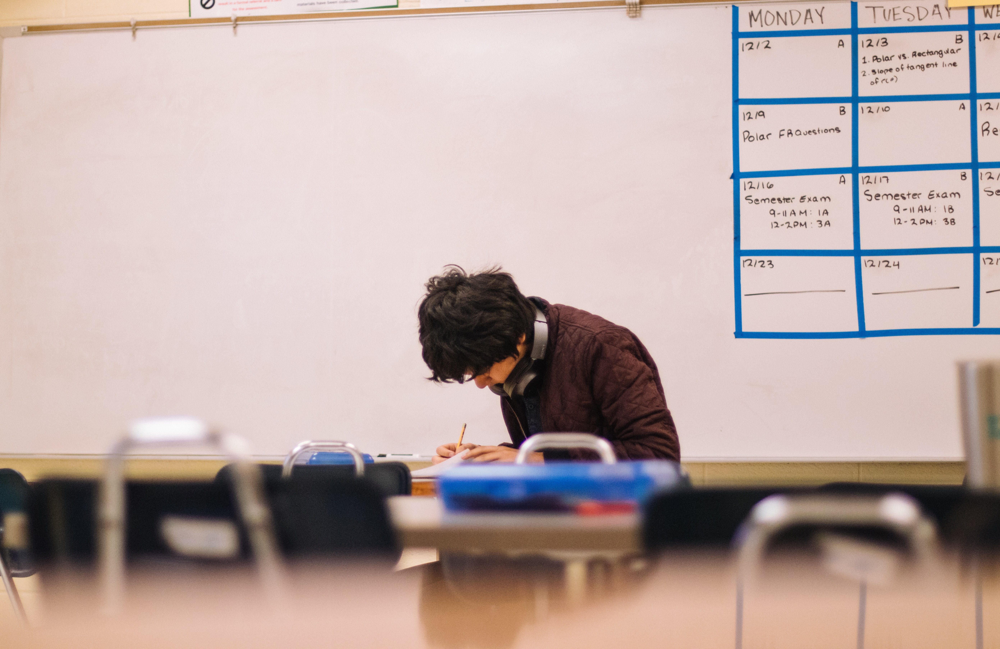
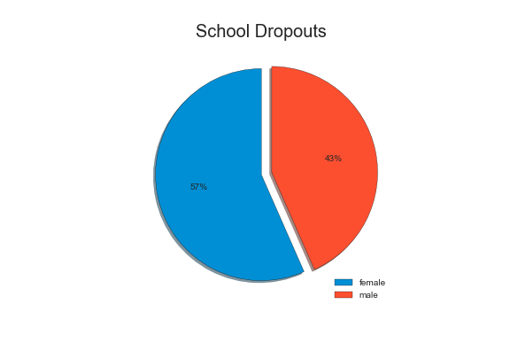

# Finding the Secret to Academic Success

Author: Gamze Turan

|  |
|:--:|
| <b>Fig.1 Student taking part in an exam (Image Credits -  Photo by <a href="https://unsplash.com/@jeswinthomas?utm_source=unsplash&utm_medium=referral&utm_content=creditCopyText">Jeswin Thomas</a>)
  </b>|
  
  
## Overview

My goal is to examine the **effects of several socio-economic factors** on the **grades of secondary school students.** These analyses will allow us to predict student performance based upon a variety of features like study hours, alcohol comsumption, parent's education, etc.

I will run some interesting analysis like -

  1. Effect of Alcohol consumption on Student performance.
  2. Does being in a relationship affect high school student performance?
  3. Impact of a parent's education on student grades. This can be very useful as a lot of schools use parent's education as a criteria for admission. This analysis can present an argument either in favor or against this approach.
  
Finally, I will create various machine learning models to predict student's final performance and then compare these models using a set of accuracy metrics.

## Business Understanding 

My initial focus will be on understanding whether **alcohol comsumption** can have an **impact on student performance** or not. In United States, one in four individuals between the ages of 12 and 20 reported ninge drinking alcohol on a monthly basis ([source:niaaa.nih.gov](https://www.niaaa.nih.gov/publications/brochures-and-fact-sheets/underage-drinking)).Underage drinking has become a very serious health concern and binge drinking by young people poses enormous health and safety risks.

There has been a steady rise in the number of teenagers found driving under the influence and this behaviour often leads to serious accidents resulting in property damage, injuries, and sometimes deadth as well ([source:drugfree.org](https://drugfree.org/drug-and-alcohol-news/23-of-teenssurveyed-admit-to-driving-under-influence-of-alcohol-or-drugs/)). Thus, it is critical that we implement prevention strategies during early adolescence to prevent escalation in alcohol consumption.

I will run similar analyses for multiple factors. Based upon my observations, I will try to build a **persona of a model student** who has the highest chance of academic success.

This information can then be used by school districts, academic counsellors, and parents to help guide their students towards better school performance.

## Data Understanding 

I will use the [UCI Machine Learning Repository: Student Performance Data Set](http://archive.ics.uci.edu/ml/datasets/Student+Performance) to present interesting insights about the factors that predict student performance.

> Source:
  P. Cortez and A. Silva. Using Data Mining to Predict Secondary School Student Performance. In
  A. Brito and J. Teixeira Eds., Proceedings of 5th FUture BUsiness TEChnology Conference
  (FUBUTEC 2008) pp. 5-12, Porto, Portugal, April, 2008, EUROSIS, ISBN 978-9077381-39-7.
  Available at: [Web Link](www3.dsi.uminho.pt/pcortez/student.pdf).
  
This data contains student achievement information in secondary education of two Portuguese schools. The data attributes include student grades, demographic, social and school related features and it was collected by using school reports and questionnaires. Two datasets are provided regarding the performance in two distinct subjects: Mathematics(`student-mat.csv`) and Portuguese language(`student-por.csv`).

In [Cortez and Silva, 2008](www3.dsi.uminho.pt/pcortez/student.pdf), the two datasets were modeled under binary/five-level classification and regression tasks.

## Data Preparation

Our target, the final score,  lies between 0 and 20. The average score is 11.34.
There are a lot of students that score 0 in the final score. These represent students who dropped out of school.

|  |

Overall females do better than males in school, but more females drop out of high-school.

As many as 36% of high-school dropouts can be attributed to teen pregnancy!

|  |

