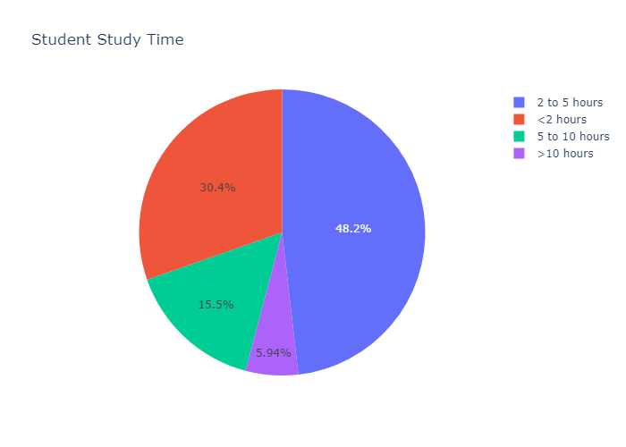
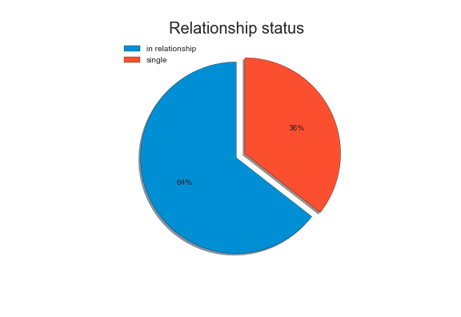

# Finding the Secret to Academic Success

Author: Gamze Turan

|  |
|:--:|
| <b>Fig.1 Student taking part in an exam (Image Credits -  Photo by <a href="https://unsplash.com/@jeswinthomas?utm_source=unsplash&utm_medium=referral&utm_content=creditCopyText">Jeswin Thomas</a>)
  </b>|
  
  
## Overview

My goal is to examine the **effects of several socio-economic factors** on the **grades of secondary school students.** These analyses will allow us to predict student performance based upon a variety of features like study hours, alcohol comsumption, parent's education, etc.
 
Finally, I will create various machine learning models to predict student's final performance and then compare these models using a set of accuracy metrics.

I will be using **[CRISP-DM](https://thinkinsights.net/data-literacy/crisp-dm/)** data scheme process for this project.

## Business Understanding 

Based upon the observations received from a multi-variate analysis, I will try to build a personal of a model student who has the highest chance of academic success.

This information can then be used by school districts, academic counsellors, and parents to help guide their students towards better school performance.

## Data Understanding 

I will use the [UCI Machine Learning Repository: Student Performance Data Set](http://archive.ics.uci.edu/ml/datasets/Student+Performance) to present interesting insights about the factors that predict student performance.

> Source:
  P. Cortez and A. Silva. Using Data Mining to Predict Secondary School Student Performance. In
  A. Brito and J. Teixeira Eds., Proceedings of 5th FUture BUsiness TEChnology Conference
  (FUBUTEC 2008) pp. 5-12, Porto, Portugal, April, 2008, EUROSIS, ISBN 978-9077381-39-7.
  Available at: [Web Link](www3.dsi.uminho.pt/pcortez/student.pdf).
  
This data contains student achievement information in secondary education of two Portuguese schools. The data attributes include student grades, demographic, social and school related features and it was collected by using school reports and questionnaires. Two datasets are provided regarding the performance in two distinct subjects: Mathematics(`student-mat.csv`) and Portuguese language(`student-por.csv`).

In [Cortez and Silva, 2008](www3.dsi.uminho.pt/pcortez/student.pdf), the two datasets were modeled under binary/five-level classification and regression tasks.

## Data Analysis

  

The target `final_score`,  lies between 0 and 20. The average score is 11.34. There are a lot of students that score 0 in the final score. These represent students who dropped out of school.

 

Overall females do better than males in school, but more females drop out of high-school. Let's look at the relationship status of the females that are dropping out of school. 

Approximately 70% of all females who left school were in a relationship. According to literature, as many as 36% of high-school dropouts can be attributed to teen pregnancy!

### Study Time

Majority students spend 2 to 5 hours of their time every week studying.

I see that as study time increases, the average score of the student increases.

### Urban vs Rural

72% of all students live in urban areas. They might have better access to schools and education but also might have more distractions. 

These boxplots indicate that students residing in urban areas tend to perform better than students residing in rural areas.

Let's try and analyze a variety of factors that might cause this. One of them I believe is `commute_time`. 

Rural students tend to have higher commute times than urban students: 

It is well known that students with higher commute time usually get less time to study and thus there studies suffer.(Kobus et al., 2018)

Additionally, many rural students lack access to internet, more so than urban students.

Studies have shown that having access to internet improves academic performance. This is true for our dataset as well:

### Wish to go for Higher Education

Majority of the students in our dataset wish to opt for higher education. As a lot of higher education programs consider academic performance in the admission criteria, it is expected that students who desire to go that path will focus more on earning a better grade. 

This is the case with our dataset as well:

### Romantic Relationship

High school relationships have a tendency to be volatile and can end up causing a lot of stress for a teenager as they are not fully mature to deal with emotional aspects of a relationship. 

Approximately 64% of the students in our dataset are in a relationship.

The following boxplot indicates that single students perform better in their exams:

### Parents Education

Many studies indicate that parent's education levels have a critical impact on a child's academic and long-term career success. (Dubow et al., 2009)

In our dataset, Mothers seem to be better educated than fathers. None represent the cases where no information is available(orphans).

It can be seen that for both the parents, having better education will lead to better academic success for the student. 

### Alcohol Consumption

Considering that it is illegal in US to drink below 21 years of age, it is surprising to know that nearly 50% of all high school students drink alcohol. Excesive consumption of alcohol in people below 21 years of age is considered to be responsible for approximately 4,300 deaths every year from 2006 -2010 (Esser et al., 2016).

Studies indicate that increase in alcohol consumption leads to poorer academic performance(Balsa et al., 2012, Ansari et al., 2013). 

I will see if our dataset shows similar trend. Two columns in our dataset will be our prime focus:

* `weekday_alcohol_usage`: workday alcohol consumption (from 1 - very low to 5 - very high)
* `weekend_alcohol_usage`: weekend alcohol consumption (from 1 - very low to 5 - very high)

It's good to see that 70% of the students drink very low alcohol on weekdays. As expected alcohol usage increases over the weekend.

Increasing Alcohol consumption has detrimental effects on student performance. Effect is more profound in the case of weekday drinking.

## Modeling

**Objective**: Predict Student Final Score

- Output would be a predicted final score from 0 to 20

**Data Wrangling**:

To prepare the data for machine learning, we performed several data wrangling tasks. These include: 
1. Splitting the data into y : target (final score), X : all predictors
2. Converting all nominal variables into one-hot encoded columns. 
3. Converting all ordinal variables to numerical ones using LabelEncoder.
4. Using MinMaxScaler to normalize data
5. Splitting the data into training, validation and testing subsets

**Feature Selection**:
I used Random Forest to get a subset of **important** features to use for final modeling. The 16 features I receive are as follows:

I first used a Baseline Dummy Regressor to get baseline accuracy values. The predictor was awful as expected and gave a negative R-Squared of -0.033.While this might seem odd but R-Squared can have a negative value.In practice, this only happens when your models predictions are worse tahn consatant function that always predicts the mean of the test dataset.

Following that I used many popular ML regressors and tuned the hyper-parameters of each one of them to get the best possible model for our dataset. I tested each one 5 times(5 different samples of testing set) and presented the mean accuracy metrics for all of these models. Here are the accuracy results:

The best accuracy values that I received were for the Random Forest model with a R-Squared of 0.917. Random Forest are excellent for analysis as they are very robust models and also help provide key insights from the model. 

Here are the residual plots for the same:

The predicted values seem to be randomly scattered around the actual values with no distinguishable pattern. 

## Conclusion

Student's academic success is usually thought to be dependent on student's dedication and hardwork. These analyses pointed out that while those parameters are important, there are other background factors that impact student's final score.

The Exploratory Data Analysis revealed many interesting ideas from the data such as:

* Father's education status seems to be more relevant to student's success.
* Students living with both their parents or stable households seem to be perform better.
* Students who wish to go for higher education perform better in school.
* Increased commute time has a negative impact on academic performance.
* Increasing weekly study time perform better in final score.
* Student’s who has better internet access, perform better.
* Alcohol consumption also has a negative impact on academic performance.

These are just some of the insights that were found in the data. These ideas were than supported by the machine learning modeling stage which showed that the same features were important for predicting final score.

I selected Random Forest Regressor as our final model where I received a mean R-Squared of 0.92.

## Future Work

While I have covered a lot of bases in this analysis, more can be done to improve the analysis further.

It would be interesting to implement an online system where we look at these factors while a student is studying and then conduct experiments to see, if additional school support can help students who are predicted to perform poorly.

Many of the analyses presented in this report can be used as guidelines and recommendations for school districts. For example, providing students, who don't have access to internet at home, with mobile hotspots.

I can also study school dropouts in more details and analyze the factors that cause dropout in more detail.

In the next iteration, I would also like to deploy our ML model as web application which is integrated with the school district rostering systems. This will allow for schools to continuously monitor the progress of its students and take corrective measures if required.

## For More Information

See the full analysis in the Jupyter Notebook or review this presentation.

For additional info, contact Gamze Turan at ginaturan15@gmail.com

## References
* P. Cortez and A. Silva. Using Data Mining to Predict Secondary School Student Performance. In A. Brito and J. Teixeira Eds., Proceedings of 5th FUture Business TEChnology Conference (FUBUTEC 2008) pp. 5-12, Porto, Portugal, April, 2008, EUROSIS, ISBN 978-9077381-39-7. ([link](www3.dsi.uminho.pt\pcortez\student.pdf))
* UCI Machine Learning Repository: Student Performance Data Set ([link](http://archive.ics.uci.edu/ml/datasets/Student+Performance))
* Teen Pregnancy as cause of School Dropout ([link](https://www.caf.com/en/knowledge/views/2021/01/teen-pregnancy-as-a-cause-of-school-dropout/))
* Pradhan, R. & Sinha, Niharika. (2017). Impact of commuting distance and school timing on sleep of school students. Sleep and Biological Rhythms. 15. 10.1007/s41105-017-0091-0. ([link](https://www.researchgate.net/publication/313851579_Impact_of_commuting_distance_and_school_timing_on_sleep_of_school_students))
* Reading Scores by Computer Use and Internet Access at Home (2015), National Center for Education Statistics ([link](https://nces.ed.gov/pubs2017/2017098/ind_15.asp))
* DeVries JM, Rathmann K, Gebhardt M. How Does Social Behavior Relate to Both Grades and Achievement Scores? Front Psychol. 2018 Jun 4;9:857. doi: 10.3389/fpsyg.2018.00857. ([link](https://www.ncbi.nlm.nih.gov/pmc/articles/PMC5994475/))
* Esser MB, Clayton H, Demissie Z, Kanny D, Brewer RD. Current and Binge Drinking Among High School Students — United States, 1991–2015. MMWR Morb Mortal Wkly Rep 2017;66:474–478. ([link](https://www.cdc.gov/mmwr/volumes/66/wr/mm6618a4.htm))

## Repository Structure 

├── data

├── Deliverables

├── images

├── Finding the Secret to Academic Success - Capstone Project.ipynb

├── Finding the Secret to Academic Success - Capstone Project.ipynb

└── README.md